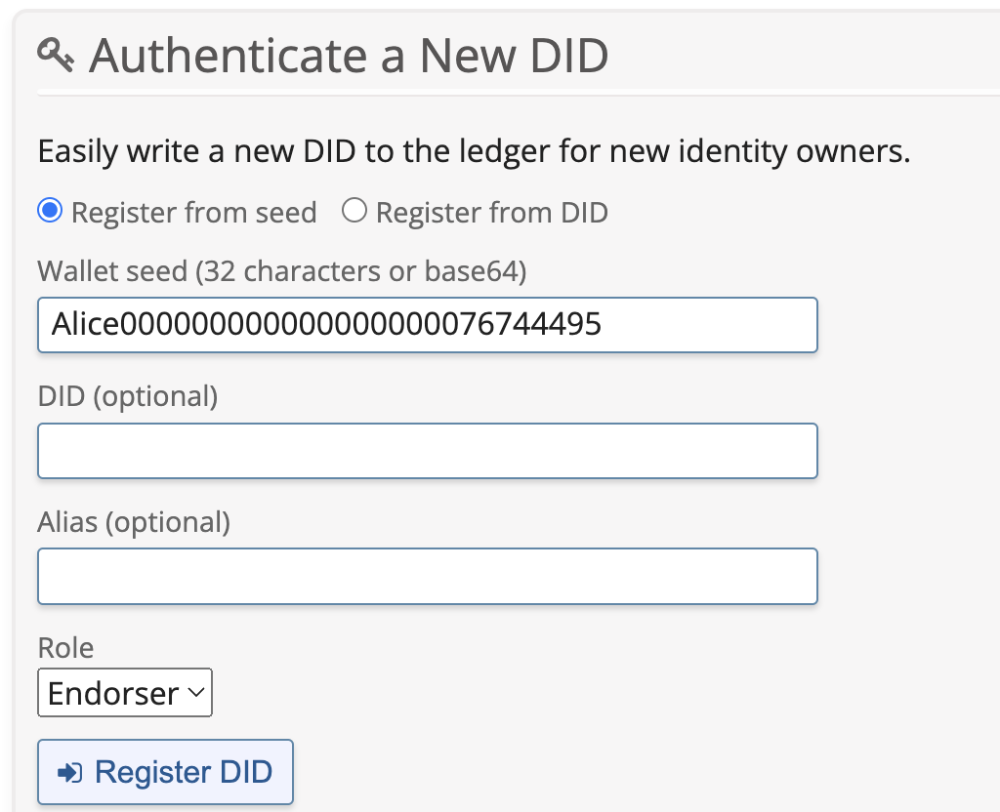
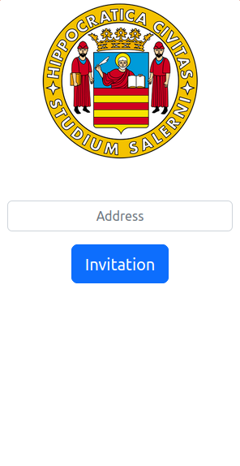
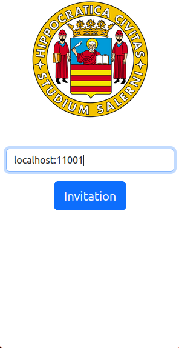
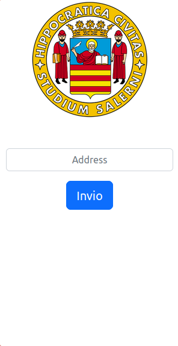
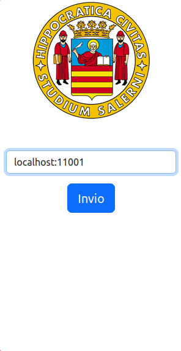
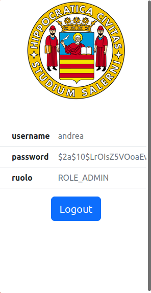

# Self-Sorveign Identity (SSI) attribute based authentication

This repo contains the implementation of a SSI-compliant web server.
It defines the end-point necessary to interact with Aca-Py agent.

Structure of the repo
```
    - Holder (Contains the Firefox extension that must be run by who wants to access to the SSI-compliant web server)
    - Issuer (Contains the Firefox extension that must be run by who wants to issue credentials for the access to the defined SSI-compliant web server)
    - ssi_solid_integration (Contains the code for the SSI-compliant web server)
```
The current work aims at show the basic interaction without any check on connection, in future development checks on security of extensions must be done.
Moreover, it's possible that future development may move the role of agents (which is currently based on Firefox extensions) to mobile devices (in case of Holder) or directly within the server (in case of Issuer).

As described in doc, the technology behind the SSI is the Hyperledger Aries, which is based on Hyperledger Indy. A valid solution for Indy is the <a href="https://github.com/bcgov/von-network">VON Network</a>, which is a portable development Indy Node network, offering an environment which contains a web-based interface containing the nodes and the public ledger; moreover it allows a user to see the status of the nodes of a network and browse/search/filter the Ledger Transactions.
Details on how to run this network can be found below.

A valid implementation, instead, for Hyperledger Aries, which communicate with the VON Network is implemented in Python, namely <a href="https://github.com/hyperledger/aries-cloudagent-python">Aca-Py</a>. In assumed that the agents run on the user machine and on the server machine reps.; SSI-compliant server is responsible for the communication with such agents and extensions using the parameters passed through the extension.
## Von Network


It's possible to install the Von Network for Hyperledger Aries using Docker
container or directly on local machine.
### Steps to follow to install Hyperledger Aries on Local Machine
1. Install Python and PIP manager -> https://www.python.org/downloads/
2. Clone the VON Network and navigate inside the directory.
    
    ```
    git clone https://github.com/bcgov/von-network.git
    cd von-network
    ```

3. Configure a virtual environment.
    ```
    virtualenv --python=python3.6 venv
    source venv/bin/activate
    ```
4. Install Python requirements.
    ```
    pip install -r server/requirements.txt
    ```

### Steps to follow to install Hyperledger Aries using Docker container
1. Execute Docker build
    ```
    ./manage build
    ```

2. Start VON Network
    ```
    ./manage start --logs
    ```

#### Once completed
To stop the Docker container ```./manage stop```, to clean the ledger ```./manage down```

# ACA-py
In order to test communication with Indy Ledger inside 
the Docker container and create instances we will use a Python 
script able to create a communication with the Ledger.

First of all it's important to remember that Indy Ledger 
is Permissioned ledger, so not everyone can create new DIDs.
Only Trust Anchors or Trustees can do this. So, if you want to add
a new DID (NYM transaction), you need to do it being a Trust Anchor 
or Trustee.

Indy Ledger Platform offers the possibility to authenticate a new DID
using web interface:



In our case, we proceed to register the seed `Alice000000000000000000076744495`

Once a DID is added to the Ledger, only the owner can modify it (for example rotate keys). 
The Trust Anchor that created this DID can not modify it anymore. 
This is one of the principles of Self Sovereign Identity (SSI).

So, we create a new "Entity" Alice, able to create new Verifiable Credentials, to do so after we registered a Seed using the interface of Hyperledger Aries; it's possible to execute the command.

```
docker run -p 8000:8000 -p 11000:11000 bcgovimages/aries-cloudagent:py36-1.16-1_0.8.0 start \
--label Alice \
-it http 0.0.0.0 8000 \
-ot http --admin 0.0.0.0 11000 \
--admin-insecure-mode \
--auto-accept-invites \
--auto-accept-requests \
--genesis-url http://host.docker.internal:9000/genesis \
--seed Alice000000000000000000076744495 \
--endpoint http://host.docker.internal:8000/ \
--debug-connections \
--auto-provision \
--wallet-type indy \
--wallet-name Alice1 \
--wallet-key secret
```

This will be our Issuer, namely Alice, able to emit VC for all the requesting Holder.
Let's do a request for new VC from the new user Bob.

First of all, we need to declare a new user, which will be able to connect to the Ledger.

```
docker run -p 8001:8001 -p 11001:11001 bcgovimages/aries-cloudagent:py36-1.16-1_0.8.0 start \
--label Bob \
-it http 0.0.0.0 8001 \
-ot http --admin 0.0.0.0 11001 \
--admin-insecure-mode \
--auto-accept-invites \
--auto-accept-requests \
--genesis-url http://host.docker.internal:9000/genesis \
--endpoint http://host.docker.internal:8001/ \
--debug-connections \
--auto-provision \
--wallet-local-did \
--wallet-type indy \
--wallet-name Bob1 \
--wallet-key secret
```

Notice that in this case, we do not defined the seed because we do not need to attach to any existing DID,
but, instead, we will ask to Alice to issue new VC.
Short recap: only Authorities need to attach them to new DID, since they need to be authorized.

It's possible to execute ACA-Py directly on local machine, but we discourage this approach.
More information are available https://github.com/hyperledger/aries-cloudagent-python

## Installazione estensione Firefox
1. Scaricare questa repo come Zip file
2. Estrarre il file 
3. Dalla pagina about:debugging cliccare su Questo firefox dal menu a sinistra
4. Cliccare componente aggiuntivo
5. Caricare il file manifest.json in estensione/manifest.json

## Avvio ACA-py
# Tramite Doker
bash
docker run --net=host bcgovimages/aries-cloudagent:py36-1.16-0_0.6.0 start --label Alice -it http 0.0.0.0 8000 -ot http --admin 0.0.0.0 11000 --admin-insecure-mode --genesis-url http://localhost:9000/genesis --seed Alice000000000000000000076744495 --endpoint http://localhost:8000/ --debug-connections --auto-provision --wallet-type indy --wallet-name Alice1 --wallet-key secret


bash
docker run --net=host bcgovimages/aries-cloudagent:py36-1.16-0_0.6.0 start --label Bob -it http 0.0.0.0 8001 -ot http --admin 0.0.0.0 11001 --admin-insecure-mode --endpoint http://localhost:8001/ --genesis-url http://localhost:9000/genesis --debug-connections --auto-provision --wallet-local-did --wallet-type indy --wallet-name Bob1 --wallet-key secret


## Avviare ACA-py in locale
bash
aca-py start --label Bob -it http 0.0.0.0 8001 -ot http --admin 0.0.0.0 11001 --admin-insecure-mode --endpoint http://localhost:8001/ --genesis-url http://localhost:9000/genesis --debug-connections --auto-provision --wallet-local-did --wallet-type indy --wallet-name Bob1 --wallet-key secret


bash
aca-py start --label Alice -it http 0.0.0.0 8000 -ot http --admin 0.0.0.0 11000 --admin-insecure-mode --genesis-url http://localhost:9000/genesis --seed Alice000000000000000000076744495 --endpoint http://localhost:8000/ --debug-connections --auto-provision --wallet-type indy --wallet-name Alice1 --wallet-key secret


Il seed utilizzato da Alice è ottenibile eseguendo l'applicazione e facendo una richiesta post localhost:8080/init, il seed viene mostrato in console nel log dell'applicativo springboot.


# Avvio Demo
Dopo aver avviato l'istanza dell'holder (Bob) e l'istanza dell'issuer (Alice) è necessario che i due agent Holder e Issuer si mettano in comunizazione. Per farlo bisogna effettuare una richiesta all'url localhost:8080/invitation; questo è possibile farlo attraverso l'estensione firefox relativa all'issuer inserendo nel campo l'indirizzo relativo all'agent dell'holder con cui si vuole comunicare (esempio mostrato in figura, localhost:port).

 


Dopodichè è necessario creare uno schema effettuando una richiesta POST all' url localhost:8080/createSchema sempre utilizzando l'estensione issuer e aggiungendo i campi che si desidera.


In conclusione è possiblie ottenere le credenziali effettuando una richiesta POST a localhost:8080/issueCredencial utilizzando l'estensione holder. Per specificare a quale holder si fa riferimento bisogna inserire l'indirizzo dell'agent holder localhost:port (ad esempio Bob localhost:11001). Se l'utente è già in possesso delle credenziali saranno visualizzate le proprie informazioni.







Altrimenti se l'utente ancora non ha le credenziali può compilare il form relativo ed ottenerle.


Per autenticarsi al sistema con le credenziali ottenute da una pagina di login d'esempio è possibile accedere tramite SSI


Aprendo nuovamente l'estensione è possibile accettare. In risposta si ottiene un token JWT da utilizzare per accedere alle risorse web. 


Se si vuole aggiungere un nuovo utente ad eesempio Oscar basterà avviare un istanza avviando un agent tramite il comando, con il numro di porta differente da quelli già in uso :

bash
docker run --net=host bcgovimages/aries-cloudagent:py36-1.16-0_0.6.0 start --label Oscar -it http 0.0.0.0 8002 -ot http --admin 0.0.0.0 11002 --admin-insecure-mode --endpoint http://localhost:8002/ --genesis-url http://localhost:9000/genesis --debug-connections --auto-provision --wallet-local-did --wallet-type indy --wallet-name Oscar1 --wallet-key secret

Tramite l'estensione del issuer (Alice) bisognera invitare il nuovo utente inserendo il suo indirizzo (localhost:11002)


una volta fatto ciò si ripetono gli stessi passi effettuati per l'agent d'esempio Bob
