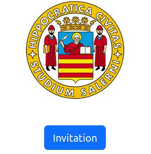
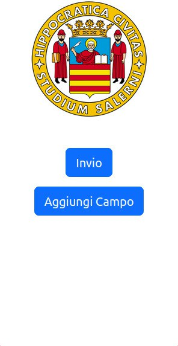
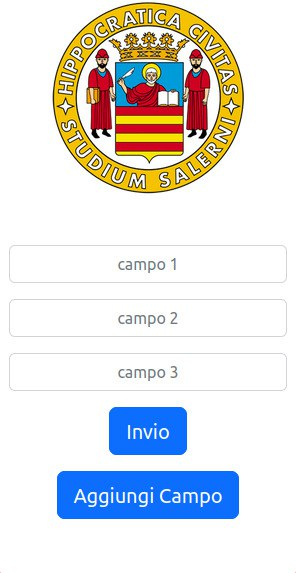
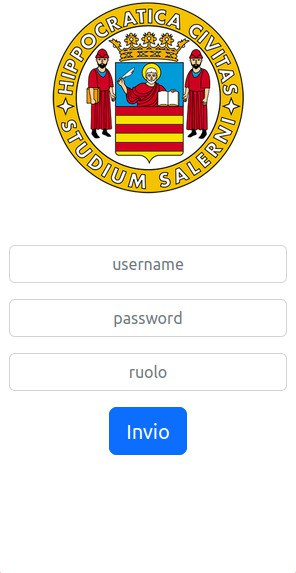
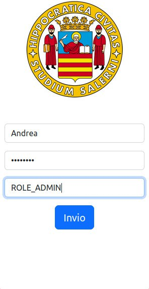
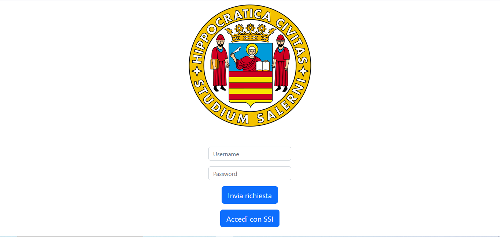
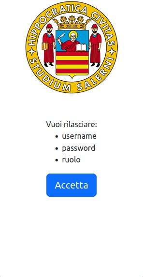
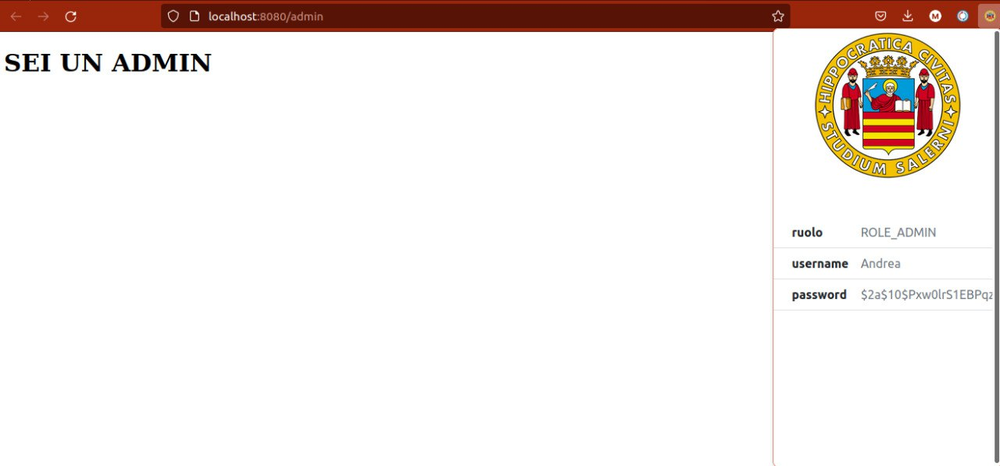

## Avviare il web server sulla tua local machine

1. Installa python and pip

2. Download questa repository:

```bash
git clone https://github.com/bcgov/von-network.git
cd von-network
```

3. Se utilizzi virtualenv, configura un ambiente virtuale e attivalo:

```bash
virtualenv --python=python3.6 venv
source venv/bin/activate
```

4. Installa:

```bash
pip install -r server/requirements.txt
```

5. Effettuare il build del doker container
```bash
./manage build
```

6. Avviare la Von-Network
```bash
./manage start --logs
```

### Per stoppare la Von-Network
```bash
./manage stop
```

### Per stoppare e pulire il ledger
```bash
./manage down
```
# ACA-py

Se si vuole eseguire ACA-py in locale eseguire
```bash
pip3 install aries-cloudagent
``` 
è necessario il pakage libindy scaricabile su Ubuntu 18.04 usando i seguenti comandi :
```bash
$ sudo apt-key adv --keyserver keyserver.ubuntu.com --recv-keys 68DB5E88
``` 
```bash
$ sudo add-apt-repository "deb https://repo.sovrin.org/sdk/deb bionic master"
``` 
```bash
$ sudo apt-get update
``` 
```bash
$ sudo apt-get install -y libindy
``` 
# Docker
Se non si vuole installarlo in locale è possibile utilizzare un doker container. L'immagine è possibile scaricarla al seguente link:
 https://hub.docker.com/r/bcgovimages/aries-cloudagent

## Installazione estensione Firefox
1. Scaricare questa repo come Zip file
2. Estrarre il file 
3. Dalla pagina `about:debugging` cliccare su `Questo firefox` dal menu a sinistra
4. Cliccare componente aggiuntivo
5. Caricare il file `manifest.json` in `estensione/manifest.json`

## Avvio ACA-py
# Tramite Doker
```bash
docker run --net=host bcgovimages/aries-cloudagent:py36-1.16-0_0.6.0 start --label Alice -it http 0.0.0.0 8000 -ot http --admin 0.0.0.0 11000 --admin-insecure-mode --genesis-url http://localhost:9000/genesis --seed Alice000000000000000000076744495  --endpoint http://localhost:8000/ --debug-connections --auto-provision --wallet-type indy --wallet-name Alice1 --wallet-key secret
``` 
```bash
docker run --net=host bcgovimages/aries-cloudagent:py36-1.16-0_0.6.0 start --label Bob -it http 0.0.0.0 8001 -ot http --admin 0.0.0.0 11001 --admin-insecure-mode --endpoint http://localhost:8001/ --genesis-url http://localhost:9000/genesis --debug-connections --auto-provision --wallet-local-did --wallet-type indy --wallet-name Bob1 --wallet-key secret
``` 
## Avviare ACA-py in locale
```bash
aca-py start --label Bob -it http 0.0.0.0 8001 -ot http --admin 0.0.0.0 11001 --admin-insecure-mode --endpoint http://localhost:8001/ --genesis-url http://localhost:9000/genesis --debug-connections --auto-provision --wallet-local-did --wallet-type indy --wallet-name Bob1 --wallet-key secret

```
```bash
aca-py start --label Alice -it http 0.0.0.0 8000 -ot http --admin 0.0.0.0 11000 --admin-insecure-mode --genesis-url http://localhost:9000/genesis --seed Alice000000000000000000076744495  --endpoint http://localhost:8000/ --debug-connections --auto-provision --wallet-type indy --wallet-name Alice1 --wallet-key secret
``` 
Il seed utilizzato da Alice è ottenibile eseguendo l'applicazione e facendo una richiesta post localhost:8080/init


# Avvio Demo
Dopo aver avviato l'istanza di BoB è necessario che i due agent Alice e BoB si mettano in comunizazione. Per farlo bisogna effettuare una richiesta GET all'url localhost:8080/invitation; questo è possibile farlo attraverso l'estensione firefox.




 Dopodichè è necessario creare uno schema effettuando una richiesta POST all' url localhost:8080/createSchema sempre utilizzando l'estensione e aggiungendo i campi che si desidera.




 
 In conclusione è possiblie ottenere le credenziali effettuando una richiesta POST a localhost:8080/ utilizzando l'estensione e issueCredencial.





Per autenticarsi al sistema con le credenziali ottenute da una pagina di login d'esempio è possibile accedere tramite SSI



Aprendo nuovamente l'estensione è possibile accettare. In risposta si ottiene un token JWT da utilizzare per accedere alle risorse web. 






